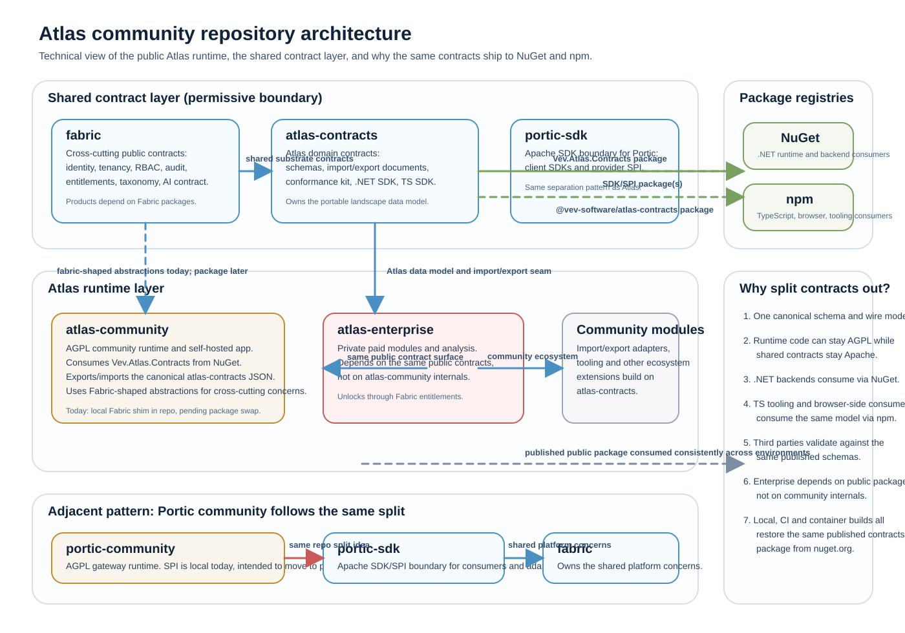

# Atlas · Community Edition

**A living map of your architecture, always current.**


Atlas is VEV's enterprise-architecture platform, run as open core. This repository is the
free, self-hostable **Community Edition** (`atlas-community`, AGPL-3.0): it catalogues the
systems, applications, servers, infrastructure and data layer you run and keeps that picture current.
The paid capabilities that *work with* that data live in **Atlas Enterprise**, the
separately-licensed commercial edition developed outside this public repository.

> **Status: early.** The Community runtime foundation is in place — a tenant-scoped asset
> catalogue (CRUD, manual relationships, tags) over an API-first .NET stack, consuming the
> public Fabric contracts with local signed-snapshot entitlement evaluation, plus architecture
> fitness tests that fail the build on a boundary violation.
> Self-hosted packaging (Docker + Compose) is in the tree; basic visualisation is still landing.
> Treat anything not yet in the source tree as intended direction rather than a shipped feature.

## Quick start (local dev)

Get it in your hands and see it run — the landscape UI above is what you'll be looking at.

**Prerequisites:** the [.NET 10 SDK](https://dotnet.microsoft.com/download). The public
[`Vev.Atlas.Contracts`](https://www.nuget.org/packages/Vev.Atlas.Contracts) package restores from
nuget.org, so a plain checkout of this repo is enough (see
[docs/DEVELOPMENT.md](./docs/DEVELOPMENT.md#prerequisites)).

**Windows (PowerShell):**

```powershell
./start.ps1
```

**Any platform:**

```bash
ASPNETCORE_ENVIRONMENT=Development dotnet run --project src/Atlas.Api
```

Then open **http://localhost:5199/** — you get the landscape UI, an OpenAPI document at
`/openapi/v1.json`, and a health probe at `/health`. In local dev, identity runs in header-shim mode,
so you can act as any tenant with the `X-Tenant-Id` / `X-Principal-Id` / `X-Principal-Roles` headers.

Prefer a container, or want it running outside your editor? See
[Run it (self-hosted)](#run-it-self-hosted) for the one-command Docker/Podman path (`./deploy.ps1` on
Windows), which starts in secure-by-default OIDC mode on port 8080.

## What you get (free, self-hostable)

Asset management — a genuinely useful place to hold your landscape, not crippled shareware:

- An asset repository for systems, applications, servers, infrastructure, data areas,
  datasets and columns — create, edit, hold and browse.
- Basic visualisation of the landscape you hold.
- Manual relationships, join keys and tags on assets.
- Customer-owned data export — a portability guarantee, not an afterthought.

## Growing into Atlas Enterprise

The moment you want more than a catalogue — integration mapping, end-of-life intelligence,
application-portfolio management, roadmapping, AI-assisted architecture review, plus
discovery ingestion, enterprise connectors, governance and hosting — those are paid
capabilities in **Atlas Enterprise**, the separately-licensed commercial edition.
Community and Enterprise share the public data model and contracts, so the public
edition stays interoperable without documenting proprietary deployment details here.

## Interoperability & portability

Your data is yours, and the map is meant to interoperate with the tools you already own:

- **[`atlas-contracts`](https://github.com/Vev-software/atlas-contracts)** — the public data
  model and import/export schemas (Apache-2.0).
- **Customer-owned export & import** — `GET /api/v1/export` downloads your whole tenant
  landscape as a portable atlas-contracts document; `POST /api/v1/import` loads a bundle back
  in (merge or replace). Both run through an explicit **format-adapter seam**, so the core
  portability boundary is the canonical contract form and nothing else.
- **Community modules** — open format adapters such as ArchiMate import/export, BPMN import
  and report exporters, built against the public contracts. They compose onto the seam by
  registering a format adapter — they never change the core boundary.

Compatibility and versioning expectations for exported documents are in
[`docs/DEVELOPMENT.md`](./docs/DEVELOPMENT.md#portability-export--import).

## How Atlas is built

- **Standalone and independently deployable.** Atlas solves a real problem on its own, with
  no hard runtime dependency on any other VEV product.
- **On the shared substrate.** Identity, tenancy, RBAC, audit, telemetry, configuration and
  entitlements come from VEV's shared substrate (Fabric) through explicit, versioned
  contracts — never through another product's internals. Atlas owns the
  enterprise-architecture domain; the substrate owns the cross-cutting concerns.
- **AI-native, never vendor-bound.** AI features go through a provider-neutral AI contract,
  so the capability is permanent and the provider behind it is disposable. Routing Atlas's
  AI through VEV's [Portic](https://github.com/Vev-software/portic-community) gateway is an
  optional integration, never a requirement.
- **API and SDK first.** The UI orchestrates the API; it is never the only way in.

## Repository architecture



`atlas-community` is the running product: the AGPL runtime, API, UI and persistence. It does **not**
own the public wire format. That boundary lives in
[`atlas-contracts`](https://github.com/Vev-software/atlas-contracts), which holds the versioned Atlas
data model, import/export schemas, conformance kit and the generated SDKs. That is why
`Atlas.Domain` consumes `Vev.Atlas.Contracts` as a package instead of embedding those types directly in
the runtime: Community, Enterprise and third-party tooling all need the same canonical contract without
depending on each other's internals.

**Why npm packages?** Because the same contract has TypeScript consumers as well as .NET consumers:
browser-side tooling, CLIs, import/export adapters, validation utilities and any ecosystem code that
needs to read or emit Atlas documents should consume `@vev-software/atlas-contracts` from npm rather
than re-implement the schema.

**Why NuGet?** Because the .NET runtimes consume the same contract on the backend. `atlas-community`
references `Vev.Atlas.Contracts` from NuGet, so its API, export/import seam and tests all speak the
published Atlas contract from nuget.org like any other public package.

The same split exists around Portic: the runtime lives in
[`portic-community`](https://github.com/Vev-software/portic-community), while the reusable SDK/SPI
boundary belongs in [`portic-sdk`](https://github.com/Vev-software/portic-sdk). Across both products,
[`fabric`](https://github.com/Vev-software/fabric) stays underneath as the shared substrate contract
layer for identity, tenancy, entitlements, audit and other cross-cutting concerns.

## Run it (self-hosted)

One command brings up the API, a persistent SQLite catalogue and a bundled Keycloak for authentication:

```bash
docker compose up --build          # or: podman compose up --build
curl http://localhost:8080/health  # {"status":"ok"}
```

On Windows, `./deploy.ps1` wraps this: it picks Podman or Docker, builds the image and runs it on
port 8080 (`./deploy.ps1 -Down` tears it back down).

### First-run setup

Atlas is **secure by default**: every request requires authentication. The bundled Keycloak ships
with a single admin account that **must change its password on first login**:

1. Open **http://localhost:8081/realms/atlas/account/**.
2. Sign in with username `admin` and password `changeme`.
3. Keycloak will require you to set a new password before Atlas can issue API tokens.
4. Then open **http://localhost:8080/** and sign in to Atlas with the new password.

The Keycloak admin console is at **http://localhost:8081** (admin / admin) if you need to manage
users, create additional accounts, or inspect roles.

**No default credentials are usable after the first-run password change.** The `changeme` password
is marked `temporary` in Keycloak, so it cannot be reused after the first login.

Want to run without authentication for local development? See
[Development identity modes](./docs/DEVELOPMENT.md#identity--tenancy) for the `single-tenant` and
`dev-headers` modes.

Hostnames and paths are deployment configuration — the default is a flat single-host shape with no
`vev.software` assumption. For a white-label host or a reverse-proxy sub-path, see
[URLs & hosting](./docs/DEVELOPMENT.md#urls--hosting).

Your catalogue persists on a named volume across restarts. It holds your whole landscape map, so
encrypt it at rest — see
[Encryption at rest](./docs/DEVELOPMENT.md#encryption-at-rest). Full instructions are in
[`docs/DEVELOPMENT.md`](./docs/DEVELOPMENT.md).

Tagged releases publish a signed image to `ghcr.io/vev-software/atlas-community` with an SBOM and
provenance you can verify with [cosign](https://docs.sigstore.dev/) before you run it — see
[Supply chain: SBOM & signed provenance](./docs/DEVELOPMENT.md#supply-chain-sbom--signed-provenance).

## Security

Report vulnerabilities privately — see [`SECURITY.md`](./SECURITY.md), never a public issue. The
Community runtime's threat model, the controls that defend the landscape map, and the supported
runtime/compatibility posture are in
[`docs/threat-model.md`](./docs/threat-model.md).

## Repository layout

```
src/
  Atlas.Fabric.Abstractions  Atlas-side seam over the public Fabric contracts + allowance UX types
  Atlas.Fabric.Dev           Local authz/audit + signed-snapshot entitlement evaluator
  Atlas.Domain               Asset catalogue domain; consumes the public atlas-contracts model
  Atlas.Persistence          EF Core / SQLite behind the repository port
  Atlas.Api                  ASP.NET Core minimal API (API/SDK-first) + OpenAPI
tests/
  Atlas.Architecture.Tests   Boundary fitness tests — fail the build on a violation
  Atlas.Api.Tests            Full-stack integration tests
```

Build, test and run instructions are in [`docs/DEVELOPMENT.md`](./docs/DEVELOPMENT.md).

## License

This repository — the Atlas **Community Edition** — is licensed under the **GNU Affero
General Public License v3.0** (AGPL-3.0); see [LICENSE](./LICENSE).

Atlas is open core: the Community Edition here is free and open source, while the Atlas
Enterprise capabilities are separately licensed and developed outside this repository.
The public data-model and import/export contracts are published separately under the Apache
License 2.0.

---

© VEV Software ApS.
